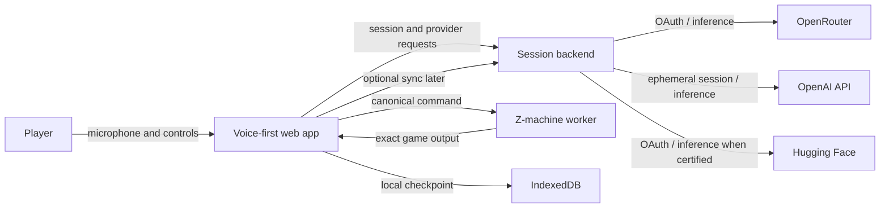
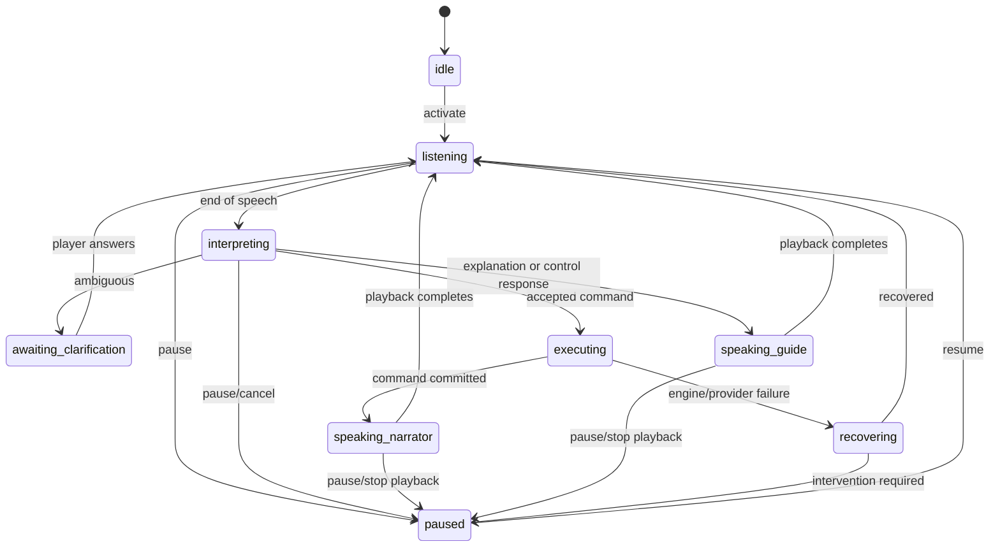

# Zork Voice Architecture

Status: initial implementation contract  
Companion: [Product and Technical Strategy](./strategy.md)

## 1. Architectural drivers

The system must provide a low-latency, voice-first conversation while retaining
the exact behavior of the licensed Zork story. Its defining constraint is a
one-way authority boundary:

> The guide proposes; the command coordinator validates; the Z-machine commits.

No language model, provider callback, UI component, transcript projection, or
memory store can directly modify game state. Ordinary in-world mutations use a
serialized canonical command sent through the engine adapter. Explicit lifecycle
changes such as restore or restart use separate validated adapter operations,
require the applicable confirmation policy, and never masquerade as guide tool
results.

Other drivers are:

- minimal default visuals with optional accessible transcript and debug views;
- distinct narrator and guide roles;
- provider portability across OpenRouter, OpenAI, and conditional Hugging Face
  capabilities;
- recoverable, atomic saves at engine command boundaries;
- privacy-preserving browser audio and credential handling;
- deterministic tests that do not require live model or audio services.

## 2. System context



The engine runs in a dedicated browser worker for isolation and predictable UI
latency. The backend is a backend-for-frontend (BFF), not a game server in the
initial release. It owns provider authorization, any deployment credentials,
short-lived session issuance, and optional redacted usage records. Local play
state remains in the browser until cloud saves are explicitly introduced.

Hosted AI makes network connectivity a runtime requirement. There is no local
model mode in the initial architecture.

## 3. Runtime components

### 3.1 Web application

The web application is a TypeScript PWA with four layers:

- **Audio session:** microphone permission, capture, resampling/encoding,
  explicit turn-taking, playback, interruption, and audio-focus handling.
- **Interaction coordinator:** owns the session state machine, event ordering,
  provider calls, guide tool requests, command serialization, and recovery.
- **Engine worker client:** communicates with the authoritative Z-machine
  adapter by a versioned message protocol.
- **Projections:** minimal status UI, visible transcript/captions, debug view,
  screen-reader announcements, and local persistence.

UI projections consume events; they do not call the engine or providers
directly. This ensures that hiding all prose changes presentation only.

### 3.2 Session backend

The backend exposes narrowly scoped endpoints:

```text
POST /api/session
GET  /api/providers
GET  /api/auth/:provider/start
GET  /api/auth/:provider/callback
POST /api/realtime/session
POST /api/inference/:role
DELETE /api/connections/:provider
```

Exact paths may change, but their responsibilities may not be collapsed into
client-side secret handling. The backend must:

- bind OAuth state and PKCE material to an HttpOnly, Secure, SameSite session;
- store long-lived provider credentials encrypted at rest when a provider flow
  yields them;
- keep deployment API keys server-side;
- issue only short-lived, scoped browser credentials where supported;
- enforce provider/model allowlists, request size limits, rate limits, and
  per-session cost budgets;
- redact authorization values, raw audio, and transcript content from default
  logs;
- support disconnect and deletion of stored provider credentials.

The frontend must not put provider secrets in localStorage, IndexedDB, URLs,
analytics, error reports, or debug exports.

### 3.3 Z-machine engine worker

The worker packages a tested Z-machine interpreter and the audited story
artifact. It accepts a small protocol:

```ts
export interface EnginePort {
  boot(input: BootRequest): Promise<BootResult>;
  execute(input: ExecuteRequest, signal?: AbortSignal): Promise<ExecuteResult>;
  snapshot(): Promise<EngineSnapshot>;
  restore(snapshot: EngineSnapshot): Promise<RestoreResult>;
  inspectPublicState(): Promise<PublicEngineState>;
}

export interface ExecuteRequest {
  requestId: string; // idempotency key for the coordinator
  expectedRevision: number;
  command: CanonicalCommand;
}

export interface ExecuteResultBase {
  requestId: string;
  previousRevision: number;
  revision: number;
  command: string;
  output: string; // exact decoded game output
  turnComplete: true;
  boundary: "input-requested" | "terminated";
}

export type ExecuteResult =
  | (ExecuteResultBase & { status: "committed" })
  | (ExecuteResultBase & {
      status: "rejected";
      rejection: "stale_revision" | "duplicate" | "invalid_command";
    });
```

`CanonicalCommand` is a branded, length-limited, newline-free string produced by
the command validator. Only one stateful engine operation may be in flight;
overlap is rejected rather than queued. The worker maintains a bounded receipt
journal keyed by `requestId`, so a network/UI retry cannot silently submit a
command twice. `expectedRevision` rejects stale actions. The receipt journal is
part of the opaque snapshot: restoring a checkpoint restores that branch's
receipts and discards receipts created later on the abandoned branch.

The adapter tracks the confirmed turn boundary. A `terminated` result blocks new
commands until a successful restore returns an `input-requested` boundary or a
fresh worker and adapter are booted. Rejected restore operations preserve the
active revision and boundary.

Production restore uses a replacement worker lease rather than mutating the
active worker in place. The coordinator first verifies the outer snapshot,
creates a candidate worker/adapter, asks that candidate to validate and restore
the runtime-specific envelope, and requires it to reach the snapshot's declared
boundary without publishing boot or prompt output. Only then may it atomically
swap the active lease and dispose the former worker. Any validation, startup,
boundary, timeout, or cancellation failure disposes the candidate and preserves
the active worker, revision, boundary, and receipt journal.

The current generic worker adapter is a single-transport protocol scaffold; it
does not yet implement that factory/lease swap. The isolated Dork spike stages a
replacement in-process interpreter session and demonstrates part of the
failure-atomicity shape, but it is not wired into a real worker adapter and is
not an accepted runtime.

The engine’s binary snapshot, not an LLM reconstruction or event replay, is the
authoritative save state. Randomness, interpreter quirks, and input timing make
an event log useful for diagnostics but insufficient as the only restore format.
Semantic replay can rebuild UI projections and exercise a recorded guide turn
without another model call; it does not replace the verified engine snapshot.

### 3.4 Dungeon Guide

The guide consists of deterministic policy around a probabilistic model:

```text
player-safe context builder
        -> guide model adapter
        -> decision schema validator
        -> guide policy gate
        -> command validator (execute decisions only)
        -> command coordinator
```

The model returns exactly one decision. The provider-neutral runtime schema is
defined once in the normative
[Dungeon Guide decision contract](./guide-agent.md#guide-decision). Architecture
code imports that contract; provider adapters return `unknown` until the schema
validator accepts it. In particular, a model can request a hint level but cannot
supply solution prose directly—the deterministic hint-policy boundary selects
the permitted content.

The policy gate rejects unknown fields, malformed output, unavailable objects,
hidden facts, solution material in ordinary explanation, commands over the
configured length, command separators/newlines, and decisions inconsistent with
session state. Rejection becomes a safe clarification or provider error; it
never falls through to execution.

The initial bounded implementation lives in `packages/guide-core` and
`packages/command-knowledge`. It validates the full decision union but enables
only execute, clarification, and deterministic command-help explanation for the
first vertical slice. Its curated opening grammar and caller-supplied observed
object names are a narrow bootstrap view, not the complete generated grammar,
memory model, or hint registry described below.

An execute decision contains one command. A multi-step player request is stored
as a pending goal and advanced through successive decisions, one command per
engine revision. Each intermediate response is observed and revalidated before
another command is considered, and the guide's per-utterance action limit still
applies.

### 3.5 Command knowledge

The command-knowledge package is generated reproducibly from the audited ZIL
source where possible and supplemented with reviewed metadata. It has separate
views:

- **Grammar registry:** verbs, aliases, and accepted syntactic shapes used to
  validate or normalize a proposed command.
- **Observed affordance index:** interactions that are safe to mention given the
  rooms, objects, and outcomes already exposed to this save.
- **Hint registry:** reviewed, spoiler-tagged hints and solutions released only
  through hint policy.

Natural-language authorization does not require a literal grammar alias in every
valid paraphrase. Per
[ADR-0012](adr/0012-structured-semantic-command-intents.md), the provider-facing
guide selects a bounded affordance ID and typed slots from the current index.
Command knowledge validates those IDs, observed referents, revision, and local
risk tier, then compiles the canonical parser string. The current live lane
admits certified global observations and T2 examination of one explicitly named
observed object. Navigation and state-changing actions retain lexical grounding
until their contextual and confirmation contracts land.

The current affordance index is narrower than observed-memory history. A
committed movement invalidates the prior scene's object slots when its engine
output arrives, while historical observations remain available for bounded
memory and explanation. Reviewed disclosures in later authenticated engine
output repopulate the current slot set.

The normal guide context never includes the complete object table, map, puzzle
solutions, or engine memory. `inspectPublicState` exposes only supported public
facts; it is not a generic memory inspector. When reliable structured state is
not available from the interpreter, observations are derived from exact engine
responses and recorded as uncertain rather than guessed.

### 3.6 Narration

Narration has two semantic channels:

- `narrator`: exact engine prose;
- `guide`: clarifications, explanations, acknowledgements, and hints.

The audio queue preserves role and event ID. Provider adapters receive
`NarrationRequest { role, text, voice, rate }`. For narrator requests, `text`
must exactly match the associated engine event after a documented pronunciation
normalization step. A model may synthesize speech but may not summarize or add
words. Pronunciation mappings are testable and never alter the visible engine
text.

If distinct voices are not supported, a short accessible earcon distinguishes
roles. Earcons supplement, rather than replace, screen-reader role labels.

## 4. Provider abstraction

Provider profiles are compositions of small ports rather than conditionals
spread through the coordinator:

```ts
export interface Transcriber {
  readonly capabilities: TranscriberCapabilities;
  transcribe(
    input: AudioTurn,
    signal: AbortSignal,
  ): AsyncIterable<TranscriptUpdate>;
}

export interface GuideModel {
  readonly capabilities: GuideCapabilities;
  decide(input: GuideInput, signal: AbortSignal): Promise<unknown>;
}

export interface Narrator {
  readonly capabilities: NarratorCapabilities;
  synthesize(
    input: NarrationRequest,
    signal: AbortSignal,
  ): Promise<AudioSource>;
}

export interface RealtimeTransport {
  readonly capabilities: RealtimeCapabilities;
  connect(input: RealtimeSessionConfig): Promise<RealtimeConnection>;
}
```

The guide layer validates `unknown`; provider adapters may not cast provider
output directly to `GuideDecision`.

Capabilities include streaming mode, accepted audio formats, structured-output
or tool support, cancellation, voice availability, authorization mode, data
regions when known, maximum turn sizes, and usage reporting. A profile manifest
pins adapter versions and model IDs:

```ts
export interface ProviderProfile {
  id: string;
  maturity: "supported" | "experimental";
  roles: {
    transcriber: AdapterRef;
    guide: AdapterRef;
    narrator: AdapterRef;
    realtime?: AdapterRef;
  };
  conformanceVersion: string;
  dataProcessors: string[];
  limits: { maxTurnMs: number; sessionBudget?: number };
}
```

### Supported provider boundaries

- **OpenRouter:** primary split-pipeline profile, connected through the
  documented user authorization flow. Only allowlisted model combinations are
  shown. Routing fallback must not escape the configured model/license/privacy
  policy.
- **OpenAI API:** optional realtime profile. The backend creates short-lived
  client sessions using its server-side key. Realtime tool calls are normalized
  into guide decisions and still pass the policy gate and command coordinator.
- **Hugging Face:** experimental adapters or composed profiles. The app checks
  the selected inference provider and model for the required streaming,
  structured-response, and audio capabilities before offering it.

Wispr is intentionally outside the provider registry. Adding any provider
requires an adapter, authorization threat review, privacy disclosure, license
record, contract tests, benchmark results, and a profile change; it is not a
configuration-only operation.

## 5. Ordered event model

Events are the integration boundary between runtime components:

```ts
export interface EventEnvelope<TType extends string, TPayload> {
  schemaVersion: 1;
  id: string;
  sessionId: string;
  sequence: number;
  occurredAt: string;
  type: TType;
  correlationId: string;
  causationId?: string;
  visibility: "internal" | "debug" | "accessible";
  payload: TPayload;
}
```

The interaction coordinator is the single sequence allocator. It appends an
event before publishing it to projections. High-frequency audio frames and
provider transport deltas are not semantic events and are not persisted by
default; final transcripts and playback lifecycle events are.

Initial semantic event families are:

```text
session.started | session.paused | session.resumed | session.ended
audio.capture.started | audio.capture.ended | audio.playback.started | audio.playback.ended
transcript.partial | transcript.final
guide.decision.proposed | guide.decision.accepted | guide.decision.rejected
guide.clarification | guide.explanation | guide.hint | guide.cannot_comply
engine.command.requested | engine.command.committed | engine.command.rejected
engine.output
narration.requested | narration.ready | narration.cancelled | narration.failed
save.checkpointed | save.restored | save.failed
provider.connected | provider.degraded | provider.disconnected
system.error | system.recovered
```

`audio.playback.started` is emitted at the first browser `playing` event, after
synthesis, download, decoding, and buffering. Those earlier phases remain
processing and must not drive a speaking projection. Playback aborted or failed
before that boundary has no started event and is recorded only through its
terminal outcome.

Partial transcripts are ephemeral UI state unless diagnostic recording is
explicitly enabled. Events containing prose have a retention classification; the
cloud receives none by default in the local-save milestone.

## 6. Interaction state machine



An engine execution is a commit boundary. Cancellation before the coordinator
submits `execute` prevents mutation. Cancellation after submission stops future
work or audio but does not claim the command was undone. On uncertainty, the
adapter permits only an exact retry of that request. Public-state inspection may
refresh diagnostic revision and boundary data, but it does not recover the
correlated receipt and therefore cannot by itself authorize another command or
event commit. If a submitted boot or restore has an unknown result, its adapter
remains quarantined. Inspection after uncertain restore is diagnostic, and
recovery requires replacing and booting the worker/adapter rather than guessing
which snapshot is active.

Only one player turn may reach `executing`. New microphone input during guide or
narrator playback first cancels playback, emits a cancellation event, and then
opens a new turn. Stale provider responses are ignored using correlation IDs.

The bounded implementation is `packages/session`. It journals interaction IDs,
owns the `EventSequence`, and coordinates final transcript, guide policy, engine
inspection/execution, snapshot, and narration ports. Unknown engine outcomes
remain journaled with their exact request tuple; only the same interaction may
recover that receipt. Projection publication occurs after the canonical append
and cannot alter engine commit control flow.

## 7. Game state, guide memory, and saves

Three state domains remain separate:

1. **Game state:** opaque Z-machine snapshot plus engine/story compatibility
   metadata; authoritative.
2. **Guide memory:** player-visible discoveries, unresolved references, approved
   hint level, concise conversation summary, and last narratable event; advisory
   and rebuildable.
3. **Preferences:** provider profile, voices, rate, caption/debug settings, and
   consent/retention choices; never embedded in engine memory.

A save manifest is versioned and hash-addressed:

```ts
export interface SaveManifestV1 {
  formatVersion: 1;
  saveId: string;
  createdAt: string;
  committedSequence: number;
  engineRevision: number;
  story: { id: string; sourceRevision: string; artifactSha256: string };
  interpreter: {
    id: string;
    version: string;
    artifactSha256: string;
    provenanceRecordId: string;
  };
  engineAdapter: { id: string; version: string };
  engineSnapshot: {
    schemaVersion: number;
    encoding: "binary";
    sha256: string;
    byteLength: number;
  };
  guideMemory: { schemaVersion: number; sha256: string };
  eventTail?: { fromSequence: number; sha256: string };
}
```

Checkpointing occurs after a committed engine result and its corresponding
guide-memory projection. The snapshot and manifest are written atomically to
IndexedDB using a transaction; the previous valid checkpoint remains until the
new one verifies. On restore, the app verifies hashes, resolves the interpreter
provenance record, and requires the exact story artifact, interpreter artifact,
engine-adapter ID/version, and snapshot schema to be compatible before changing
the active session. The engine adapter independently recomputes the snapshot
SHA-256 before returning bytes from `snapshot()` or submitting bytes to
`restore()`; it copies those bytes before the asynchronous digest step so the
verified buffer is the buffer that crosses the worker boundary.

The generic `EngineSnapshot` byte limit is 4 MiB and must be enforced before
copying or hashing attacker-controlled bytes. A runtime envelope may impose a
smaller limit; the Dork candidate's standalone Version 3 machine checkpoint and
envelope use schema version 2 with adapter compatibility ID
`zork-voice-dork-checkpoint-v2`. Its envelope is capped at 1 MiB and its
retained last-output field at 256 KiB. A codec regression locks the complete
schema-v2 encoding to golden SHA-256
`79a7c7ff2a31ed69d2cd7045e91e84189e9fa967bab240424e6a8633c20471ba`, and the
candidate verifier pins that declaration. It persists RNG mode, gameplay state,
and a checkpointable reseed stream; positive RANDOM consumes deterministic tail
states when needed so non-divisor ranges remain unbiased. The outer
`EngineSnapshot.sha256` authenticates neither source nor sender—it detects byte
changes relative to trusted metadata. Runtime envelope decoders still perform
their own bounded structural, compatibility, and semantic validation.

The isolated Dork Worker bridge now passes copied bytes through the outer
`EngineSnapshot.sha256` path, then validates the inner envelope in a virgin
Worker before swapping active leases. Its bounded receipt journal is part of the
outer snapshot and retains every committed revision so exact retries remain
branch-local across restore. Neither integrity layer may be described as
cryptographic authenticity.

Migration code is one-way and fixture-tested. An unsupported save is preserved
and reported, never overwritten. Cloud synchronization, when added, treats the
encrypted save bundle as the unit and resolves concurrent revisions explicitly
rather than last-write-wins silently.

Raw microphone audio is not part of a save. Final transcripts are retained
locally only according to the visible-history setting and can be cleared without
invalidating the engine snapshot.

## 8. Reliability and failure handling

### Invariants

- At most one command is in flight.
- A request ID maps to at most one committed revision.
- Every `engine.output` refers to one committed command or the boot sequence.
- Narrator text refers byte-for-byte to one engine output before pronunciation
  normalization.
- No rejected or unvalidated guide decision can emit `engine.command.requested`.
- Restoring a checkpoint cannot partially replace the active session.
- Provider retries do not retry a committed engine command.

### Degradation

- Transcription uncertainty produces clarification, not a guessed command.
- Guide schema failure is retried at most once with a repair instruction, then
  becomes a recoverable spoken error.
- Narration failure keeps exact output available to the accessible projection
  and offers retry or provider fallback with disclosure.
- Provider disconnect pauses at a safe turn boundary and retains the local game
  checkpoint.
- Engine failure restores the most recent verified checkpoint and reports
  whether the last command committed.
- A provider fallback is never silent: the new data processor/model and likely
  cost change are announced or require prior opt-in policy.

Timeouts, retry counts, and circuit-breaker thresholds live in profile
configuration and are observable. Automatic retry is limited to idempotent
provider operations or engine operations with a verified request receipt.

## 9. Security and privacy boundaries

### Threat model

The architecture assumes browser extensions, malicious pasted/imported save
data, malformed provider output, compromised model behavior, accidental logging,
OAuth CSRF, replayed requests, and future untrusted story prose. It does not
trust text merely because it came from the game or a model.

Controls include:

- CSP and dependency integrity appropriate to a microphone-enabled PWA;
- permission requests immediately tied to a player gesture;
- OAuth state, PKCE where supported, redirect allowlists, and session rotation;
- HttpOnly/Secure/SameSite cookies and CSRF protection on mutations;
- encrypted credential storage with key rotation and immediate disconnect;
- no arbitrary URLs, shell calls, filesystem tools, or dynamic code tools in the
  guide surface;
- strict schemas, bounded fields, output encoding, and command normalization;
- opaque engine worker messages rather than shared mutable memory;
- per-session request, audio-duration, and cost limits;
- log allowlists and automated secret/transcript redaction tests;
- explicit disclosure of every provider receiving audio, transcript, or prose;
- configurable transcript retention and a deletion path.

Story text and provider output are data, never system instructions. Prompt
construction uses role-separated structured fields and tells the model that
embedded instructions are untrusted. Tool requests still pass deterministic
policy even if prompt isolation fails.

## 10. Observability

Every turn has a correlation ID and child spans for capture, upload, first
transcript, final transcript, guide decision, validation, engine execution,
checkpoint, narration synthesis, first audio, and playback completion.

Default telemetry contains durations, result categories, adapter/model version,
audio duration, engine revision, and provider usage totals when available. It
does not contain raw audio, transcript text, game prose, OAuth material, or full
model payloads. Content-bearing diagnostics require explicit local debug mode;
export performs another redaction pass.

Metrics are segmented by provider profile and model combination. Realtime and
split-pipeline numbers must not be combined into a misleading global latency or
cost average.

## 11. Testing seams

All domain components accept ports and clocks/ID generators through dependency
injection. The repository provides:

- an in-memory deterministic engine double with revision and receipt behavior;
- a real-interpreter fixture runner using licensed, hash-pinned story artifacts;
- scripted transcriber, guide, and narrator adapters;
- synthetic and consent-cleared audio fixtures with expected transcript intent;
- an event recorder that asserts ordering and invariants;
- save fixtures for every supported manifest and migration version;
- provider contract tests that can run against recorded responses by default and
  live services only in opt-in CI jobs.

The primary end-to-end test drives microphone-like audio through a fake or
recorded provider profile, validates the guide decision, executes the real
engine, verifies exact output and narrator input, checkpoints, restores, and
compares the next engine transition. No live paid API is required for ordinary
pull-request CI.

## 12. Repository dependency rules

The target TypeScript workspace enforces these directions:

```text
contracts <- audio
contracts <- engine
contracts <- command-knowledge
contracts + engine + command-knowledge <- guide
contracts <- providers
contracts <- persistence
contracts <- observability
contracts + events + guide + engine ports <- session

web -> audio + session + providers + persistence + observability
server -> providers + persistence + observability
```

`engine` imports no provider, UI, guide, or session package. `guide` imports
domain contracts and command knowledge but no interpreter implementation. The
session coordinator depends only on ports and never imports a provider or
interpreter. Provider packages import domain contracts but contain no game
rules. UI projections receive an event stream and cannot access an engine
implementation. Circular workspace dependencies fail CI.

Initial directories are described in
[the strategy](./strategy.md#high-level-repository-layout). Platform and library
choices within those boundaries should be recorded as short architecture
decision records before a dependency becomes difficult to replace.

## 13. Licensing and artifact provenance

The build must not fetch an unpinned story from the network. A story artifact is
accepted only when its manifest records upstream URL, source revision, license,
required notices, and SHA-256. A newly generated artifact also records its
reproducible build command and compiler version. A historical upstream-compiled
artifact whose original toolchain is unavailable may instead use an ADR-approved
immutable acquisition path with byte identity, header checks, and an explicit
statement that it is not a reproducible reconstruction. CI verifies the artifact
hash and the presence of notices.

Code license, story/content license, trademark rights, voices, sound assets,
model licenses, provider terms, and test-fixture consent are tracked separately.
No Zork logo, packaging art, or implied endorsement is derived from a source
license. Distribution naming and bundled artifacts remain release blockers until
their review is documented.

## 14. Open decisions

The following choices are intentionally deferred until a vertical-slice spike
provides evidence:

- final acceptance of the Z-machine implementation and browser-worker packaging;
  [ADR-0009](adr/0009-dork-typescript-interpreter-candidate.md) records the
  pinned Dork TypeScript core as the proposed M0 candidate and the evidence
  gates that remain open, with Bocfel retained as oracle/fallback;
- the ZIL compiler and exact reproducible story build pipeline;
- the first certified OpenRouter STT, guide, and TTS model combination;
- whether OpenAI Realtime supplies narration directly or is paired with a
  dedicated exact-text TTS path;
- which Hugging Face roles, if any, meet release latency and reliability gates;
- the hosted backend/runtime and encrypted credential store;
- whether cloud saves enter the first public release;
- final public product name after trademark review.

Deferred choices may not bypass the invariants in this document. Spikes produce
benchmarks, fixtures, and an architecture decision record, not provider-specific
logic in the domain packages.
