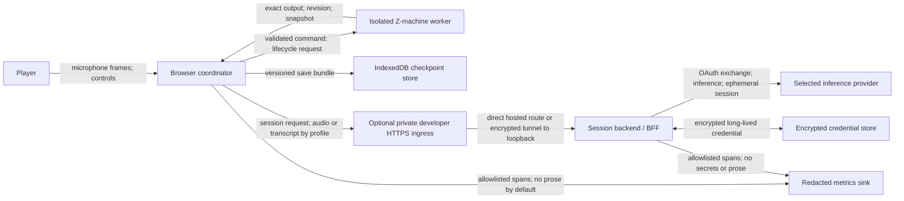

# Threat model and data flows

Status: M0 security baseline  
Last reviewed: 2026-08-19

## Scope and security objectives

This model covers the browser application, engine worker, session backend,
provider adapters, local persistence, optional operational telemetry, and the
three planned provider paths. It assumes that player speech, transcripts, saves,
guide memory, authorization material, model output, imported saves, and story
prose may all be sensitive or hostile.

The system must preserve four properties:

1. only a validated canonical command or explicit lifecycle API can mutate the
   authoritative engine;
2. a retry or interruption cannot commit the same player action twice;
3. long-lived credentials and private audio cannot leak through the browser,
   repository, logs, telemetry, or debug exports; and
4. provider failure or malicious content cannot fabricate a confirmed game
   transition.

## Trust boundaries and data flow

The browser/worker protocol, browser/HTTPS ingress, browser/backend session,
backend/provider call, and backend/credential store are separate trust
boundaries. The optional remote-device developer ingress is trusted only when it
authenticates or restricts the complete origin, terminates device-trusted TLS,
and reaches the loopback-only harness through an authenticated encrypted tunnel.
A provider response is untrusted `unknown` until normalized and validated. Story
and engine output are data, never model instructions.

## Data inventory and default handling

| Data                           | Default location                            | Retention                                  | Forbidden locations                                |
| ------------------------------ | ------------------------------------------- | ------------------------------------------ | -------------------------------------------------- |
| Microphone frames              | browser memory, then selected provider path | discarded after the turn                   | repository, ordinary logs, analytics, saves        |
| Final transcript               | browser semantic event stream               | current local history setting; clearable   | server logs and metrics by default                 |
| Partial transcript             | ephemeral browser projection                | not persisted                              | saves, telemetry, ordinary fixtures                |
| Guide context                  | browser/BFF request and provider            | bounded to observed facts and current turn | unbounded provider transcript, walkthrough store   |
| Engine snapshot                | IndexedDB                                   | until player deletes or replaces save      | model context, telemetry                           |
| Guide memory                   | IndexedDB with save                         | bounded observed-fact summary              | hidden engine state, raw provider objects          |
| OAuth verifier/state           | secure server session                       | single flow, short expiry                  | URLs after callback, client logs, analytics        |
| Long-lived provider credential | encrypted server store                      | until disconnect/revocation                | browser storage/bundle, URLs, events, debug export |
| Ephemeral realtime credential  | browser memory                              | provider expiry/session close              | localStorage, IndexedDB, logs                      |
| Operational metrics            | allowlisted local/server spans              | deployment policy                          | raw audio, transcripts, saves, auth values         |

Self-hosters must disclose any changed retention. Cloud saves are outside the
initial release and require a new data-flow review.

## Threats and controls

### Unintended or duplicate game mutation

- The coordinator serializes commands and supplies a unique request ID plus
  expected engine revision.
- The worker validates command shape and keeps a bounded receipt cache.
- Cancellation after submission never claims rollback; recovery queries the
  receipt/revision before retrying.
- Restore and restart are separate confirmed lifecycle operations.

### Prompt injection and malicious content

- Provider adapters expose no arbitrary network, code, shell, or filesystem
  tools to the guide.
- Exact game output, transcripts, imported save names, and retrieved command
  material are delimited as untrusted data.
- Normal guide context contains only observed facts; hints use a separate
  deterministic release policy.
- All decisions pass a strict schema, policy gate, and command validator.

### Credential theft and authorization confusion

- OAuth uses Authorization Code with PKCE where supported, high-entropy
  single-use state, exact redirect allowlists, and session rotation.
- Cookies are `HttpOnly`, `Secure`, and appropriately `SameSite`; mutations
  receive CSRF protection.
- Provider authorization, project identity, and future save-sync identity remain
  distinct.
- ChatGPT/Codex consumer login is never treated as OpenAI API authorization.

### Browser and web attacks

- Deploy with a restrictive CSP, output encoding, size limits, origin checks,
  rate limits, and no secrets in client bundles.
- Remote-device developer smoke uses one exact HTTPS origin, requires the raw
  `Host` and browser `Origin` to match it, and keeps the API-key-backed upstream
  on loopback. Plain LAN HTTP and a directly exposed upstream port are not
  supported.
- The private developer proxy protects every static and API path, disables
  caching and sensitive-body/header logging, and uses an encrypted tunnel when
  it is not on the developer machine. The injected live-session value is a
  same-origin request control, not user authentication.
- Treat imported save metadata and all displayed prose as untrusted strings.
- Isolate the interpreter in a worker and use copied messages rather than shared
  mutable memory.
- Validate audio/container sizes before decoding and bound memory, turn
  duration, tool calls, and provider retries.

### Privacy leakage

- Raw audio retention is off; transcript/cloud retention is opt-in and
  separately disclosed.
- Logs and telemetry use field allowlists rather than redact-after-logging.
- Debug exports omit credentials and sensitive content unless a player makes a
  deliberate, warned local export.
- Test fixtures use generated or explicitly licensed speech and sanitized
  provider responses.

### Dependency, build, and asset compromise

- Pin package resolution in a lockfile and pin release/build tooling.
- Run dependency, license, provenance, and secret checks without provider keys.
- Verify story, interpreter, save, and generated artifact hashes.
- Never publish from an unprotected pull-request context with release secrets.

### Spending and denial of service

- Enforce request size, audio duration, concurrency, retry, token, and
  per-session cost limits server-side.
- A missing usage report is an error for budgeting, not permission to continue
  indefinitely.
- Provider/model kill switches stop new sessions without altering confirmed
  local saves.
- The live developer proxy restricts who can load the token-bearing page, while
  the server retains its global request ceiling and body limits. Closing the
  process and tunnel revokes the temporary access path.

## Deletion and incident response

The visible product must offer local history/save deletion and provider
disconnect. Disconnect deletes stored credentials after revocation is attempted
and prevents new sessions even if upstream revocation is temporarily
unavailable. Deleting a transcript does not silently delete the authoritative
engine snapshot; the controls explain the distinction.

For an incident, contain the provider/model, revoke credentials, preserve only
redacted correlation and version evidence, determine whether a command
committed, add a hermetic regression, and follow the severity workflow in
[testing.md](testing.md).

## Required validation

- Security tests listed in `docs/testing.md` section 10.
- Engine idempotency and cancellation fixtures before M1 exits.
- OAuth, token-placement, log-redaction, and deletion tests per provider.
- Remote-device voice evidence verifies a secure context, exact Host/Origin
  handling, private access denial, upstream unreachability, cache/log redaction,
  and microphone behavior on the named browser/device.
- A release threat-model review whenever a new processor, persistence path,
  browser capability, imported asset class, or guide tool is introduced.
